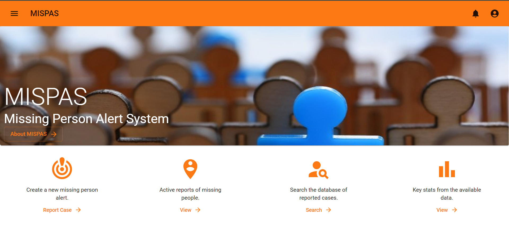

## Missing Persons Alert System

This project aims to utilize the following technologies to provide a means to immediately broadcast to the appropriate users when and where a person was reported missing. It should also notify the concerned parties when and where a person was reported seen.

- [x] Next Js
- [x] Firebase
- [x] Push Notifications
- [x] GeoLocation

It is a work in progress...Everything will be improved and fixed with time.
